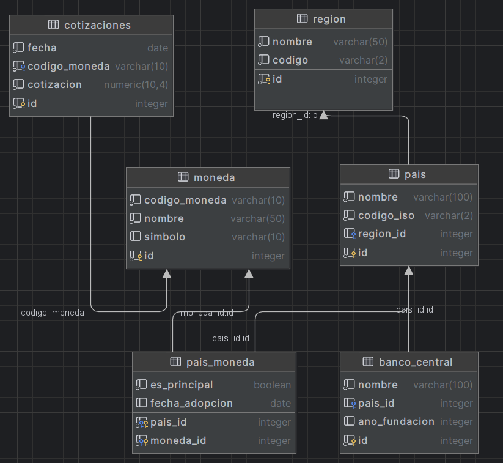

# Cotizaciones frente al peso argentino 🪙
Este proyecto ETL permite extraer datos de cotizaciones cambiarias desde la API del Banco Central de la República Argentina (BCRA), procesar la información y cargarla en una base de datos Amazon Redshift utilizando Apache Airflow desplegado en Docker.

## Descripción

El objetivo de este proyecto es automatizar el proceso de obtención y almacenamiento de cotizaciones cambiarias en una base de datos para su posterior análisis y consulta. El flujo del proceso se realiza a través de tres etapas:

1. **Extracción**: Se obtienen datos de cotizaciones cambiarias utilizando la API del BCRA.
2. **Transformación**: Se procesan y transforman los datos extraídos para adecuarlos al esquema de la base de datos.
3. **Carga**: Se cargan los datos transformados en una tabla específica de Amazon Redshift.

## Estructura del Proyecto

El proyecto tiene la siguiente estructura de directorios:
```
└── ./
    ├── .github
    │   └── workflows
    │       └── test.yml
    ├── BD
    │   ├── Creación tablas
    │   │   ├── TP.Banco.sql
    │   │   ├── TP.Moneda.sql
    │   │   ├── TP.Pais_Moneda.sql
    │   │   ├── TP.Pais.sql
    │   │   └── TP.Region.sql
    │   └── Datos históricos y tablas estáticas
    │       ├── banco_central.csv
    │       ├── Carga histórica cotizaciones.py
    │       ├── moneda.csv
    │       ├── pais_moneda.csv
    │       ├── pais.csv
    │       └── region.csv
    ├── dags
    │   └── cotizaciones_dag.py
    ├── plugins
    │   └── cotizaciones_plugin
    │       ├── scripts
    │       │   ├── __init__.py
    │       │   ├── carga.py
    │       │   ├── extraccion.py
    │       │   └── transformacion.py
    │       └── __init__.py
    ├── tests
    │   ├── __init__.py
    │   ├── test_extract.py
    │   ├── test_load.py
    │   └── test_transform.py
    ├── .gitignore
    ├── BD.png
    ├── Creacion_cotizaciones.py
    ├── Dash_cotizaciones.py   
    ├── docker-compose.yaml
    ├── Dockerfile
    ├── pytest.ini
    ├── README.md
    ├── requirements.txt
    └── run_tests.py

```

## Base de Datos en Redshift



**Fact table:**
- **cotizaciones**: contiene la evolución diaria de las cotizaciones de diferentes monedas respecto al peso argentino (disponibles en la API del BCRA).

**Dimensiones:**
- **region**
- **moneda**
- **pais**
- **pais_moneda**
- **banco_central**
  

## Instalación y configuración

#### 1.  Requisitos previos
- Tener instalado:
    * Python
    * Git
    * Docker
- Usuario de AWS Redshift

#### 2. Crear entorno de trabajo, activarlo y verificar que está activo

```bash
# Navegar a tu directorio de trabajo
cd ruta/a/tu/directorio

# Crear el entorno virtual
python -m venv entorno_virtual

# Activar el entorno virtual
# En Windows
entorno_virtual\Scripts\activate

# En macOS y Linux
source entorno_virtual/bin/activate
```
Verifica que el nombre del entorno aparece entre paréntesis al inicio de la línea de comandos:

```bash
(entorno_virtual) $
```
Confirma que estás usando el Python del entorno virtual ejecutando:

```bash
which python
```
En Windows:
```bash
where python
```
La salida debe mostrar una ruta que incluya el nombre de tu entorno virtual.

#### 3. Clonar repositorio

```bash
git clone https://github.com/leomiliano07/Cotizaciones-BCRA.git
cd Cotizaciones-BCRA  
```

#### 4. Instalar dependencias

```bash
pip install -r requirements.txt
pip install psycopg2==2.9.10
pip install dash==2.18.1
```


#### 5. Configurar variables de entorno
Cargarlas en un archivo `.env`:

```bash
# UID AIRFLOW
AIRFLOW_UID=50000

# Redshift 
REDSHIFT_HOST=
REDSHIFT_PORT=
REDSHIFT_DATABASE=
REDSHIFT_USER=
REDSHIFT_PASSWORD=
REDSHIFT_SCHEMA=

#Paht
PYTHONPATH=
```
#### 6. Crear tabla cotizaciones:

A través del script Creacion_cotizaciones.py se crea la tabla cotizaciones (fact table) en Redshift, la cual recibirá la ingesta de la API.

Opcionalmente en el directorio BD se encuentran los csv, query y script para realizar la creación y carga del resto de las tablas dimensionales como también la carga historica de cotizaciones desde la API.

#### 7. Inicia los contenedores de Docker:

```bash
docker-compose up -d
```
#### 8. Acceder a Airflow UI

Link:
http://localhost:8080

```bash
usuario: airflow 
contraseña: airflow
```


#### 9. Modificar Connections en Airflow UI y ejecutar DAG

Ingresar en el UI a Admin -> Connections, agregar una nueva y completar los siguientes campos:
```bash
Connection Id *: Redshift
Connection Id *: Amazon Redshift
Host:
Database:
User:
Password:
Port:

(Estos últimos campos se deben completar con las mismas credenciales que en el archivo .env)
```
Guardar y reiniciar Airflow.

Luego reingresar, despausar y ejecutar el DAG.

## Descripción Scripts ETL

- `extraccion.py`: se encarga de extraer datos de cotizaciones desde la API. Inicia configurando logging para monitorear el proceso. La función get_last_loaded_date se conecta a la base de datos Redshift para obtener la última fecha de cotización que se ha cargado, lo que ayuda a definir desde qué fecha comenzar a extraer nuevos datos. Luego, en extract_data, se establece la fecha de inicio para la extracción y se hacen solicitudes a la API para cada día entre esa fecha y el día actual, guardando los resultados en una lista.
- `transformacion.py`:  transforma los datos que se han extraído de la API. Si hay datos disponibles, recorre cada registro para extraer la fecha y los detalles de las cotizaciones. A continuación, crea un DataFrame de pandas que solo incluye las columnas FECHA, CÓDIGO MONEDA y COTIZACIÓN. Además, filtra las filas que contienen ciertos códigos de moneda (ARS, XAG, XAU).
- `carga.py`:  se encarga de cargar un DataFrame de pandas en una tabla de Redshift. Primero, verifica que el DataFrame no sea None y que contenga datos. Si es así, establece una conexión con la base de datos Redshift y prepara una consulta SQL para insertar los datos en la tabla.
- `cotizaciones_dag.py`:  este DAG gestiona el proceso ETL para las cotizaciones de la API. Las tareas están organizadas en el orden de extracción, transformación y carga, asegurando que cada paso del proceso se realice correctamente. 

## Tests

- `test_extract.py`:  prueba unitaria que simula la extracción de datos de la API de cotizaciones y verifica que la función extract_data retorne una lista con datos correctamente estructurados, incluyendo la cotización esperada.
- `test_transform.py`:  conjunto de pruebas que evalúa la función transform_data, asegurándose de que los datos se filtren, transformen y estructuren adecuadamente, manejando entradas vacías o incompletas.
- `test_load.py`:  simula la carga de datos a Redshift usando un DataFrame, y mockea la conexión a la base de datos con psycopg2 para evitar cambios reales, verificando que la función load_to_redshift funcione correctamente.

## Dash

Se incluye el script Dash_cotizaciones.py, el cual genera un gráfico interactivo con la evolución diaria de cada moneda, a partir de la información almacenada en la base de datos.

Luego de ejecutar el script, abrir un navegador web y visitar http://127.0.0.1:8050/ para ver el gráfico.

Es necesario haber generado y cargado la tabla moneda en Redshift.
